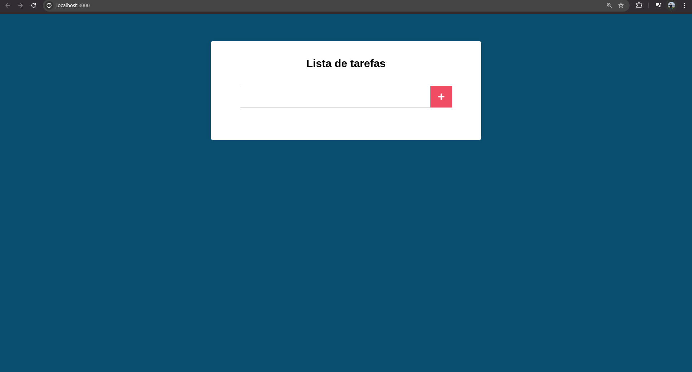

# Projeto de Lista de Tarefas

Projeto de Lista de Tarefas construído no curso de Javascript e TypeScript - front-end e back-end (Full Stack) - Node, Express, noSQL, React, hooks, Redux e Design Patterns.

## Tecnologias praticadas neste projeto

- Git;
- Eslint;
- Node.js;
- ReactJS.

## Funcionalidades do projeto

- Criação, atualização e exclusão de tarefas;
- Salvamento das tarefas localmente.

### Gif do projeto

